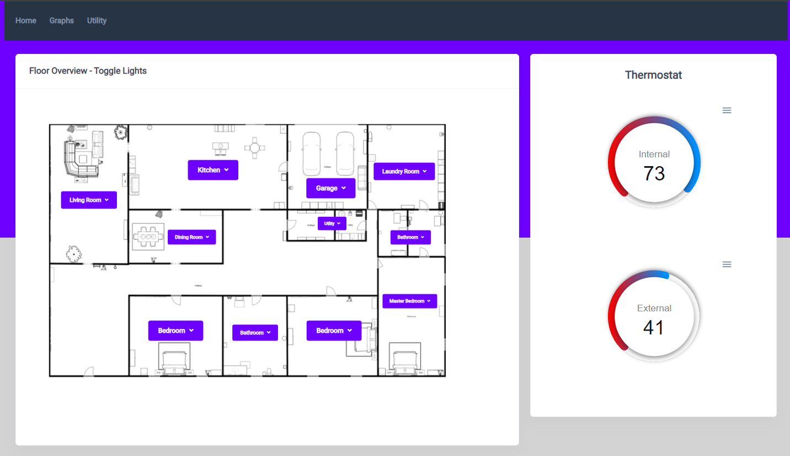
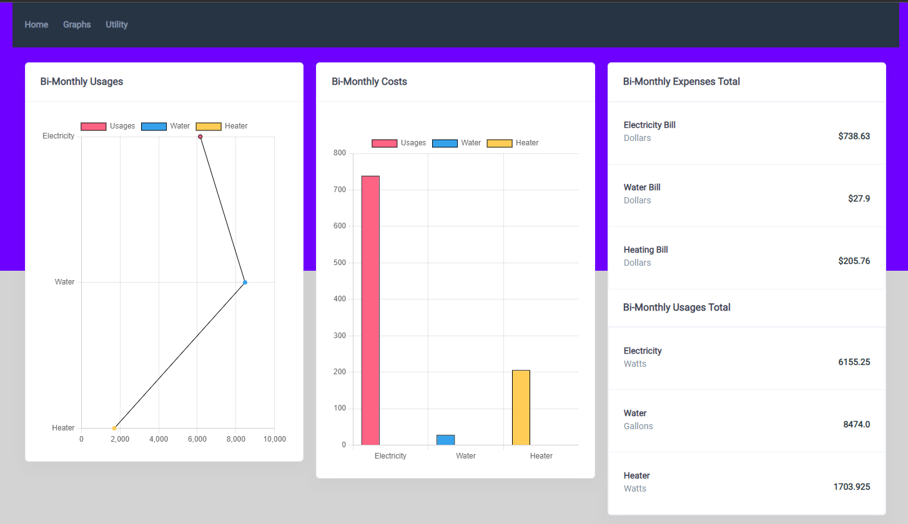
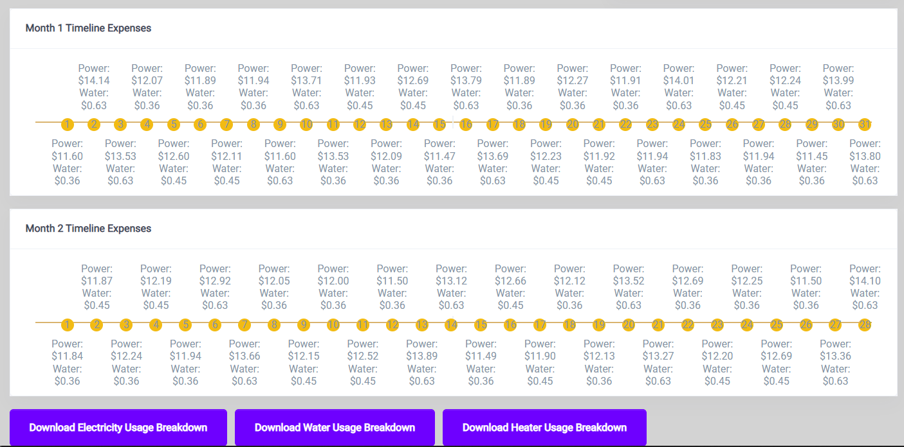
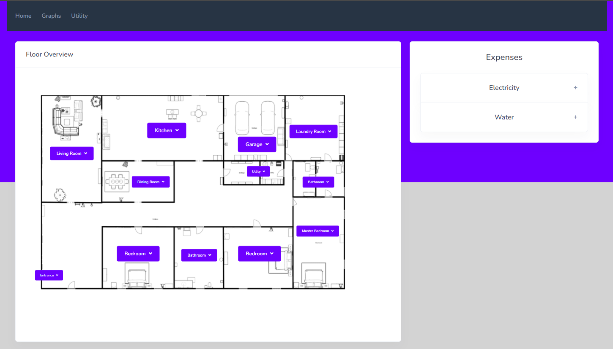
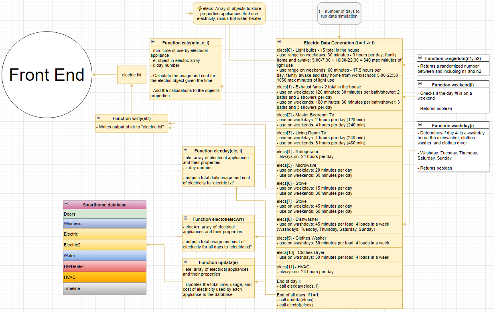
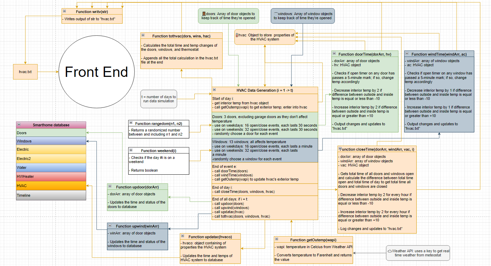

# Members: 
- Alexander Carlisle
- Diego Garcia Hernandez
- Sharman Malhi
- An Nguyen
- Derrion Parrish
- Prajun Trital

# CS499: Smarthome Project

# Description: This project is a 6-person group effort to create an application for a smart house.

# Roles
* Front end: Deals with the interface and appearance of the application
    + Diego Garcia Hernandez
    + Derrion Parrish
    + Sharman Malhi
* Back end: Deals with the coding and database of the application
    + Alexander Carlisle
    + An Nguyen
    + Prajun Trital

# Database: PostgreSQL 
## Tables
    1) Doors: properties of all door sensors; whether or not they are opened affects internal temperature
    2) Windows: properties of all window sensors; whether or not they are opened affects internal temperature
    3) HVAC: properties of hvac system that detects both internal and external temperatures and adjusts internal house temperature accordingly to doors, windows, and the thermostat
    4) Electric: properties of all sensors of electrical appliances; whether or not they are on affects power usage and cost
    5) Water: properties of all sensors that detects water usage in the house
    6) Hot Water Heater: similar properties to electric but bases hourly watt usage off of amount of hot water used
    7) Thermostat: contains information for the thermostat of inside the house

# Coding languages: Javascript, Python, and HTML/CSS 

# Interface: Flask 

# Technologies: PGAdmin4, Visual Code, IntelliJ, Atom, Git, Microsoft Teams

# STEPS TO CREATE A FLASK ENVIRONMENT FOR WEBSITES
    NOTE: PYTHON 3.0+ needs to be installed in computer previous versions not compatible
    1)	Navigate to folder where environment will be created
    2)	Copy requirements.txt file to the folder where the environment will be
    3)	Create the virtual environment using conda as followed: conda create -n <environment_name> python=3.7
    4)	Activate environment using the method below: activate <environment_name>
    5)	Inside the environment we will install the modules from the requirements file as followed pip install -r requirements.txt. DONE

# How to run a Node.js program
    1) Get Visual Studio Code
    2) Ensure NodeJS is installed first 
    3) If any code requires a client, run "npm install [client]"  
    4) Type "node [name].js" in the terminal to run the program

# Our process
    1) we started with screen plans and diagrams
    2) we met to go over who would be on front end and who would be on back end
    3) we met occasionally on Teams when needed to evaluate our progress
   
# Challenges
    1) Difficulties with JavaScript language and its various quirks
    2) Many of our team members had another concurrent CS project in CS 420
    3) Time management
    4) Having programmers that have different skill levels
    5) JavaScript was a relatively new language for many of us

# Screenshots

# Pseudocode for Back End

## electric.js
- Overall objective of electric.js file is to calculate the total energy use and total cost used by the electrical appliances. 
- Function are tasked to calculate the cost, usage, and total time for those appliances which use electricity and update them to both the front end and the database.
- Electric cost: (e.hour * (e.watt/1000) kilowatt) * $0.12
- Data generation was based off of the daily schedule of the family. Only lights usage were randomized while other objects had set times of use. 
- Outputs are sent to the electric text file which include the days, time used (units are in hours), cost, and usage.
- Results are displayed in front ends graphs for electricity stats.

## waterheater.js
- Overall objective of waterheater.js file is to calculate the daily, monthly, and total usage and cost of both using water and heating hot water by the appliances. 
- Function are tasked to calculate the cost, usage, and total for those appliances which use water and update them to both the front end and the database. 
- Water cost: (w.gallon/748) gallon * $2.52
- Heater cost: (((4 * h.gallon)/60) hour * (4500/1000) kilowatt) * $0.12
- Data generation was based off of the daily and weekly schedule of the family. The only randomized factor is which bath and shower that get used per water use event. 
- It outputs two files, water.txt and heater.txt, which include the days, gallons usage, electrical usage, and cost.
- Results are displayed in front ends graphs for both water and heater stats.

## hvacSim.js
- Overall objective of hvacSim.js file is simply to simulate the temperature change that is caused by the opening of doors and windows. 
- It includes calculating the cost, usage, and total for those appliances which use water. 
- It outputs to hvac.txt file which include the days, time of opening for doors and windows, and internal temperature changes.
- There were plans to have outputs go to the front end and be displayed in graphs, but they were unable to be implemented due to time limitations and complications. The thermostat in the front end is operational and independent of this file.

### Unfinished/Unused ideas:
- Planned functions to have an event log that gets sent to the timeline database table. Scrapped due to too much information being sent to the table, making the program compile slow and the table being too cluttered.
- Planned randomized timestamps for electric, water/heater, and HVAC events. Unfinished due to complicated and conflicting code schemes; parameter passing nightmare. Changed to daily accumulative stats for simplicity.
- All 15 light sources in the house were going to have their own object properties and randomized events, but the process was so repetitive and messy in the code that they were eventually combined into one object and the stats was multiplied simply by 15. This provided some variance in the simulation each time.
	- Similar story with the exhaust fans, but their use is based on the number of baths and showers per day
- Real time simulation for the HVAC temperature change system with speed-up feature. Unable to implement due to time constraints and difficulty working with Javascript trying to simultaneously running a timer and updating to database.

